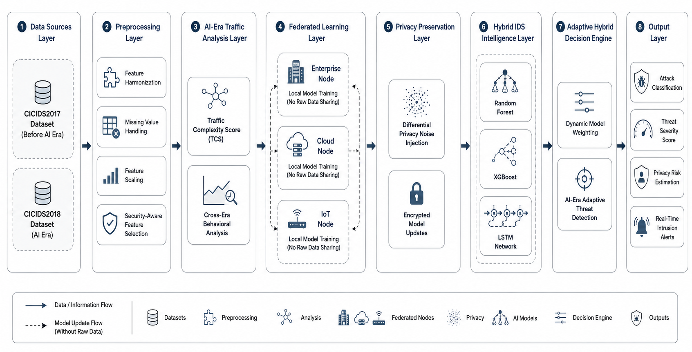

# AegisAI: Adaptive Federated Intrusion Detection System

## Privacy-Preserving AI-Era Cybersecurity Framework using Temporal Deep Learning and Adaptive Threat Intelligence

---

## Overview

Modern cybersecurity systems face increasing challenges due to the rapid evolution of AI-driven network traffic, automated attacks, cloud-native infrastructures, and privacy concerns. Traditional intrusion detection systems (IDS) often struggle to adapt to dynamic traffic behavior and centralized security limitations.

This project introduces an adaptive privacy-preserving federated intrusion detection framework capable of analyzing AI-era network behavior using temporal deep learning, federated learning concepts, and adaptive threat intelligence.

The framework performs:
- Cross-era cybersecurity traffic analysis
- Privacy-preserving federated learning simulation
- Traffic Complexity Score (TCS) computation
- Adaptive hybrid intrusion detection
- Temporal deep learning using LSTM
- Comparative evaluation against traditional ML models

---

# Architecture




---

## Key Features

- Cross-era traffic analysis using CICIDS2017 and CICIDS2018
- Feature harmonization between heterogeneous datasets
- Traffic Complexity Score (TCS) for AI-era behavioral analysis
- Federated learning simulation with distributed nodes
- Differential privacy-based privacy preservation
- Hybrid IDS intelligence using:
  - Random Forest
  - XGBoost
  - LSTM
- Adaptive model weighting and threat detection
- Comparative performance evaluation
- Real-time intrusion detection framework design

---

## Research Motivation

AI-era network traffic exhibits:
- temporal dependencies,
- sequential communication patterns,
- dynamic anomaly behavior,
- automated traffic bursts,
- evolving attack strategies.

Traditional machine learning models often fail to capture these temporal characteristics effectively.

This research investigates whether temporal deep learning architectures such as LSTM can improve adaptive intrusion detection performance while preserving data privacy using federated learning concepts.

---

## Datasets Used

The project utilizes publicly available intrusion detection datasets:

- CICIDS2017 (Before AI Era)
- CICIDS2018 (AI Era)

Due to GitHub size limitations, datasets are not included in this repository.

### Dataset Sources
- CICIDS2017: https://www.unb.ca/cic/datasets/ids-2017.html
- CICIDS2018: https://www.unb.ca/cic/datasets/ids-2018.html

---

## Methodology

### 1. Data Preprocessing
- Missing value handling
- Feature normalization
- Cross-era feature harmonization
- Security-aware feature selection

### 2. Traffic Complexity Analysis
A custom Traffic Complexity Score (TCS) is computed using:
- flow duration,
- packet rates,
- packet length variation,
- communication dynamics.

### 3. Federated Learning Simulation
The framework simulates distributed training environments:
- Enterprise Node
- Cloud Node
- IoT Node

without sharing raw network traffic.

### 4. Privacy Preservation
Differential privacy concepts are incorporated through:
- noise injection,
- encrypted model update simulation.

### 5. Hybrid Intrusion Detection
Three AI models are evaluated:
- Random Forest
- XGBoost
- LSTM

An adaptive hybrid strategy dynamically prioritizes models based on traffic complexity.

---

## Experimental Results

| Model | Accuracy | Precision | Recall | F1 Score |
|---|---|---|---|---|
| Random Forest | 87.93% | 90.67% | 87.93% | 88.04% |
| XGBoost | 86.98% | 90.43% | 86.98% | 87.15% |
| LSTM | 96.65% | 96.86% | 96.65% | 96.62% |
| Adaptive Hybrid | 93.85% | 94.79% | 93.85% | 93.68% |

### Key Observation
Experimental analysis demonstrates that AI-era cybersecurity traffic contains strong temporal and sequential dependencies, making LSTM significantly more effective than traditional machine learning methods for intrusion detection.

---

## Project Structure

```bash
adaptive-federated-ids/
│
├── results/
├── plots/
├── main.ipynb
├── adaptive_privacy_preserving_federated_ids.ipynb
├── README.md
└── .gitignore
```

---

## Technologies Used

### Machine Learning & AI
- Python
- Scikit-learn
- TensorFlow / Keras
- XGBoost

### Data Processing
- Pandas
- NumPy

### Visualization
- Matplotlib
- Seaborn

### Research & Analysis
- Jupyter Notebook

---

## Future Enhancements

- Real-time packet capture integration
- Transformer-based intrusion detection
- Explainable AI (XAI) security analysis
- Blockchain-secured federated aggregation
- Edge-device deployment
- Adaptive online learning

---

## Research Contribution

This project contributes:
- AI-era adaptive intrusion intelligence
- Cross-era cybersecurity behavioral analysis
- Privacy-preserving federated IDS framework
- Traffic complexity-aware threat detection
- Temporal deep learning evaluation for intrusion detection

---

## Authors

### R. Srilatha
Assistant Professor  
Department of Mathematics  
VNR Vignana Jyothi Institute of Engineering and Technology  
Hyderabad, Telangana, India

### Yamuna Latchipatruni
Department of CSE-(CyS, DS) and AI&DS  
VNR Vignana Jyothi Institute of Engineering and Technology  
Hyderabad, Telangana, India

### Yedida Bhavana Sree
Department of CSE-(CyS, DS) and AI&DS  
VNR Vignana Jyothi Institute of Engineering and Technology  
Hyderabad, Telangana, India

---

## License

This project is intended for academic and research purposes only.

---

## Citation

If you use this work in research or academic projects, please cite appropriately.
